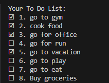

# CLI based ToDo Program 

A simple ToDo program which allows user to perform specific operations related to tasks i.e:

- **Add**
- **Update**
- **Delete**
- **Mark as done**
- **Mark as undone**
- **Show all tasks**

# 📸 Sneak Peek




____

## 🤖 CLI Commands

### 1. Add Task

```
Syntax: add <task_description>  
```

```bash
node index.js add "Buy groceries"
```

### 2. Update Task

```
Syntax: update <task_sr_no> <updated_task_description>
```

```bash
node index.js update 2 "Exercise for 30mins"
```

### 3. Delete Task

```
Syntax: delete <task_sr_no>
```

```bash
node index.js delete 1
```

### 4. Mark Task as done

```
Syntax: done <task_sr_no>
```

```bash
node index.js done 3
```

### 5. Mark Task as undone

```
Syntax: undone <task_sr_no> 
```

```bash
node index.js undone 3
```

### 6. Show all tasks

```
Syntax: show
```

```bash
node index.js show
```
___

## 🛠️ Installation

Follow these steps to set up the To-Do CLI application on your local machine.

### Prerequisites

Before installing and running this project, make sure you have the following installed on your system:

- **[Node.js](https://nodejs.org/)** (v14 or above recommended)
- **npm** (comes bundled with Node.js)


### 1. **Clone the Repository**

```bash
git clone https://github.com/raghavruia-dev/todo-cli.git
cd todo-cli
```

### 2. **Install Dependencies**

```bash
npm install
```

> This will install all required packages listed in `package.json`, with the package version as specified in `package-lock.json`.

### 3. Run the program 
```bash
node index.js add "Buy groceries"
```
Refer to the [CLI Commands](#-cli-commands) section for all available operations.


After installation you can run the commands as specified above or even use the below command to understand the commands better

```bash
node index.js help
```

___

## 📟 Tech Stack & Libraries

- Built on **JavaScript** with **node.js** as runtime environment
- [Commander.js](https://www.npmjs.com/package/commander) to build CLI Interface

___


## 🐛 TODO (Future enhancements)

- [ ] Improve error handling, by creation of JSON file if not present.
- [ ] Improve readability by implementing async await function logic.
- [ ] Implementing delete all tasks command with an option to retrieve recently deleted tasks by maintaining a backup.


